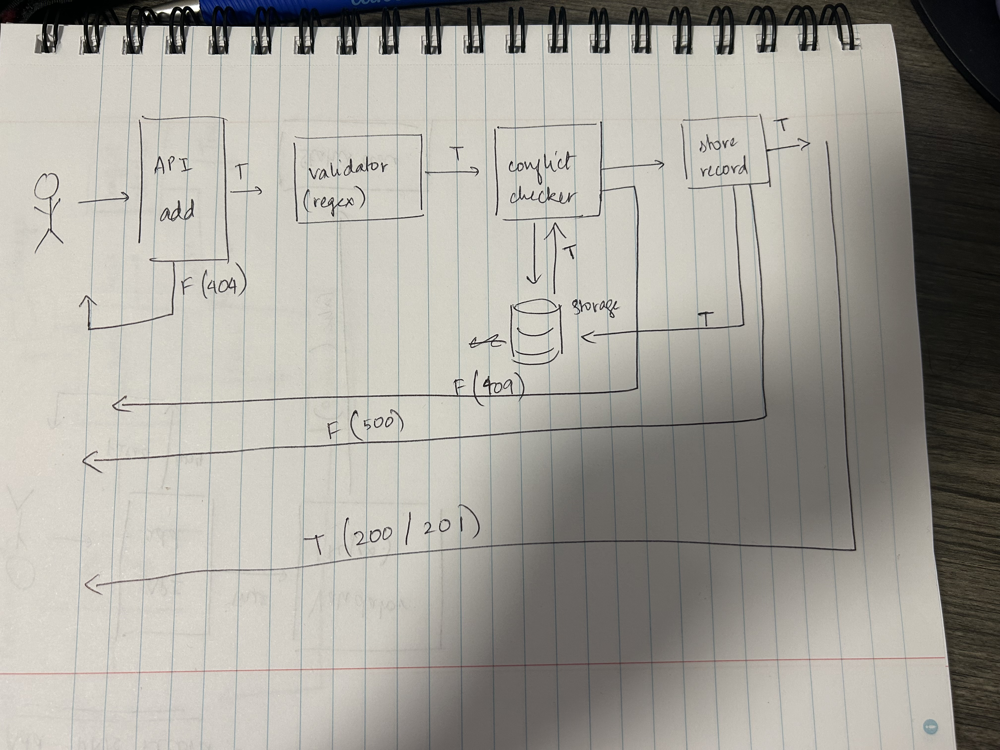
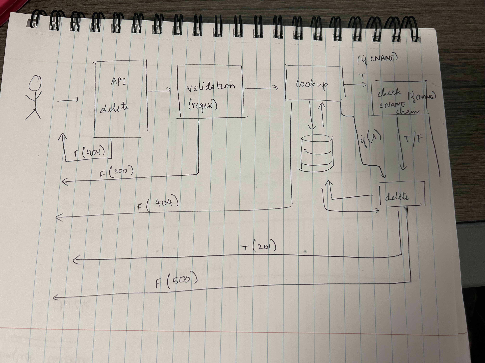

# Mini DNS Service API

This is a mini DNS service API that supports handling of DNS records like A records (IPv4) and CNAME records. The service reflects real-world DNS constraints and behaviors accurately.

## Supported DNS Record Types

- **A Record**: Maps a hostname to one or more IPv4 addresses. A single hostname can have multiple A records.
- **CNAME Record**: Maps a hostname to another hostname. Only one CNAME record per hostname is allowed, and a hostname with a CNAME cannot have any other records (e.g., A record).
- **MX Record**: Maps a hostname to a mail server for email routing.
- **TXT Record**: Stores text information for domain verification or other purposes.
- **AAAA Record**: Maps a hostname to an IPv6 address.

## DNS Record Structure

- **hostname**: String, the name of the host.
- **type**: Enum, either `A`, `CNAME`, `MX`, `TXT`, or `AAAA`.
- **value**: String (for CNAME) or Array of strings (for A, MX, TXT, or AAAA records).
- **createdAt**: Timestamp, representing when the record was created.
  
Additional fields like `TTL` (Time to Live) can be added in the future.

## API Endpoints

### 1. Add DNS Record
**POST** `/api/dns`
- **Request Body**: DNS record details (hostname, type, value)
- **Response**: Success or failure message.

### 2. Resolve Hostname
**GET** `/api/dns/{hostname}`
- **Response**: Resolves and returns the records associated with the hostname.

### 3. List DNS Records for Hostname
**GET** `/api/dns/{hostname}/records`
- **Response**: Returns all DNS records associated with the given hostname.

### 4. Delete DNS Records
**DELETE** `/api/dns/{hostname}`
- **Response**: Success or failure message after deleting the record.

### 5. Bulk Import DNS Records
**POST** `/api/dns/bulk/import`
- **Request Body**: JSON array of DNS records for bulk import.
- **Response**: Success or failure message for bulk import operation.

### 6. Bulk Export DNS Records
**GET** `/api/dns/bulk/export`
- **Response**: JSON array containing all DNS records.

## DNS Implementation Constraints

- **A Records**: Multiple A records are allowed for a single hostname.
- **CNAME Record**: Only one CNAME record per hostname. Hostnames with a CNAME cannot have other records (A, TXT, etc.).
- **CNAME Chaining**: Chaining of CNAME records is allowed, but circular references should be avoided.
- **Validation**:
  - Prevent conflicting records (e.g., CNAME and A records for the same hostname).
  - Prevent duplicate records.
  - Proper validation for hostname and IP formatting.

## Error Handling and Status Codes

This service returns appropriate HTTP status codes in case of errors or success:

- **200 OK**: Request successful.
- **400 Bad Request**: Invalid data or missing parameters.
- **401 Unauthorized**: Missing or incorrect API key.
- **404 Not Found**: Resource not found.
- **500 Internal Server Error**: Server error.

## High-Level Design

### Main Objectives:
- **Maintainable**
- **Scalable**
- **Resilient**

### System Architecture:
- **API Layer**: Manages incoming requests, routes them to respective services.
- **Lookup**: Resolves DNS records.
- **Caching**: Uses Redis for caching DNS records and TTL expiry.
- **Validator**: Ensures DNS constraints (CNAME-A conflicts, circular CNAME).
- **Storage**: Uses PostgreSQL for structured data storage.
- **Rate Limiting**: FastAPI integrates slowapi to limit the rate of requests.

### System Architecture Diagrams

**System Architecture for Add DNS Record**  

**System Architecture for Delete DNS Record**  

### Technologies:
- **Backend Framework**: FastAPI (ideal for async operations).
- **Database**: PostgreSQL for structured storage, handling joins for circular CNAMEs.
- **Caching**: Redis for caching DNS records.
- **Authentication**: API key-based authentication.
- **Rate Limiting**: Implemented using SlowAPI in FastAPI.
- **Containerization**: Docker for containerizing the application.
- **Async Task Handling**: FastAPI handles async tasks (e.g., TTL cleanup).
- **Testing**: Pytest for unit and integration tests.

## Project Structure

### 1. **API Layer**:
Handles routing for adding, deleting, listing records, bulk import/export, and resolving records.

### 2. **Authentication**:
Uses basic API key authentication. The key is stored securely in an environment variable and used in the headers for each request.

### 3. **Core**:
Contains configuration files for API keys, database URLs, Redis URLs, and logging setup.

### 4. **Models**:
Defines schemas for DNS records (e.g., DNSRecord, RecordType) and validation for each type.

### 5. **Services**:
Handles CRUD operations, bulk imports, TTL cleanup, and DNS resolution.

### 6. **Utilities**:
Contains utility functions for validating hostnames and DNS records.

### 7. **Testing**:
Contains unit tests for adding, deleting, and resolving records, including edge cases and validation checks.

## Setup and Installation

### Step 1: Clone the Repository
git clone https://github.com/yourusername/mini-dns-service.git
cd mini-dns-service

### Step 2: I have given my .env file as well. You can use it or change it accordingly. For now haven't put it in github secrets.

### Step 3: Run the Application with Docker
To build and run the service in Docker:

docker-compose build
docker-compose up

To view PostgreSQL:
docker exec -it mini-dns-db-1 psql -U postgres -d dns_db
### Step 4: Run Tests
Run unit tests to check functionality:

pytest tests/test_db.py
Note: Run tests one by one to avoid triggering rate limits (429 error).
### Step 5: To view application:
Check localhost:8000/docs 
You can view all the api's there and you can check the functionalities one by one.
Important Note:
i have used a list of strings as input for A/AAAA records,
hence some examples are as follows:
{
    "hostname": "example.com",
    "type": "A",
    "value": ["192.168.1.1"],
    "ttl_seconds": 3600
  },
  {
    "hostname": "example2.com",
    "type": "CNAME",
    "value": "example.com",
    "ttl_seconds": 3600
  },
  {
    "hostname": "invalidhostname",
    "type": "A",
    "value": ["999.999.999.999"],  
    "ttl_seconds": 3600
  },
  {
    "hostname": "example3.com",
    "type": "MX",
    "value": {
      "priority": 10,
      "host": "mail.example3.com"
    },
    "ttl_seconds": 3600
  },
  {
    "hostname": "example4.com",
    "type": "A",
    "value": ["192.168.1.2"],
    "ttl_seconds": 3600
  },
  {
    "action": "delete",
    "hostname": "example.com",
    "type": "A",
    "value": "192.168.1.1"
  },
  {
    "hostname": "example5.com",
    "type": "TXT",
    "value": ["v=spf1 include:_spf.example.com ~all"],
    "ttl_seconds": 3600
  },
  //Invalid example
  {
    "hostname": "example6.com",
    "type": "A",
    "value": ["192.168.1.3"] 
  }

Hence while adding an AAAA or A record don't forget the [] in value column.
Also while deleting you don't have to give [] just a string of one IP address works, because for A/AAAA records one record can have multiple IP address hence if you give one Ip address, it deletes just that one from the bulk list if it has more than one.

### Additional Features
Bulk Import/Export: Allows importing and exporting DNS records in bulk.Just ensure you mention action as "delete" for deleting a record:
like this:
  {
    "action": "delete",
    "hostname": "example.com",
    "type": "A",
    "value": "192.168.1.1"
  }
and a proper valid json file.

TTL Expiry: Periodically cleans up expired records using FastAPI's async tasks.

MX/TXT/AAAA Record Support: Supports additional DNS record types.

Redis Caching: DNS records are cached in Redis, with TTL support for record expiry.

Logging: Centralized logging for both testing and production environments.

### ChatGPT Chats used
https://chatgpt.com/share/6817d319-4188-800d-bb35-57e330686a75
https://chatgpt.com/share/6817d570-7808-800d-a79b-c79ee4a87cb1

### Note used a lot of stack overflow and python docs for reference

Also my initial document is present as initial docs.pdf in docs/
